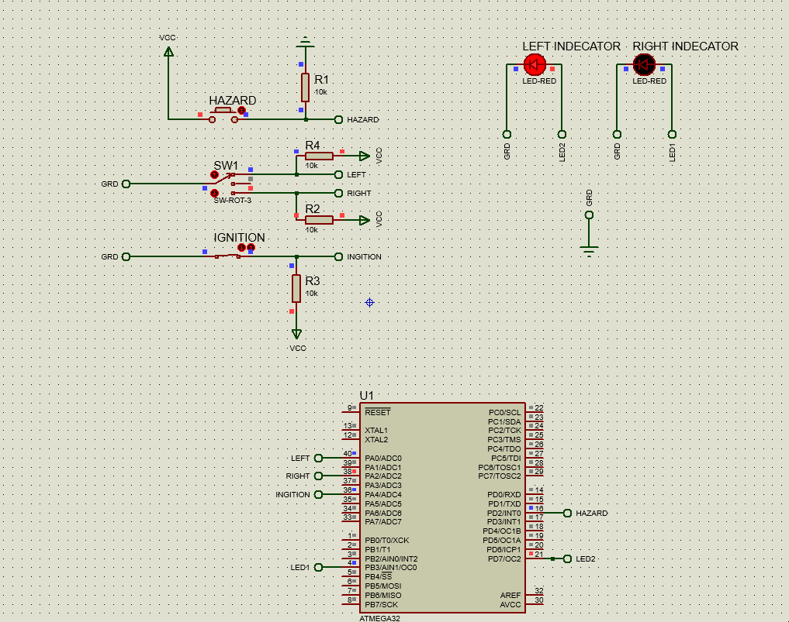
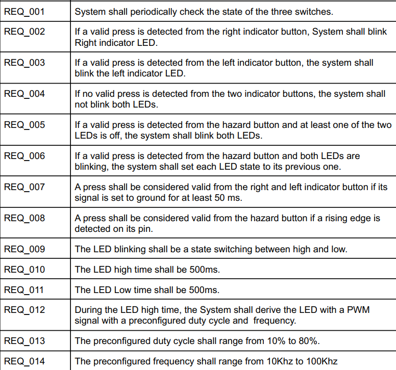
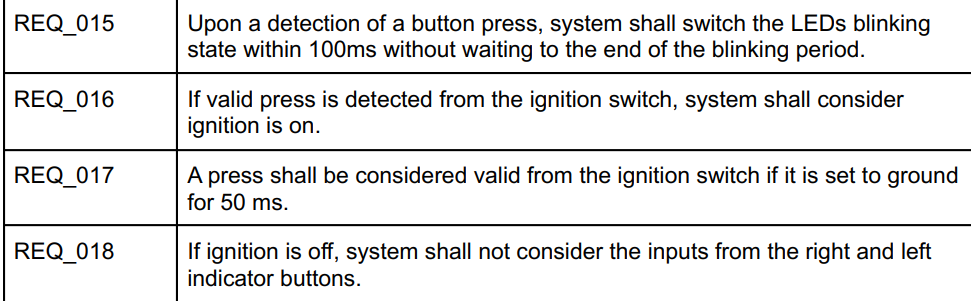
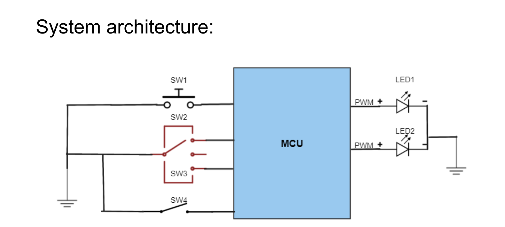

# Vehicle direction and hazard indicator controller
This project implementated the Vehicle direction and hazard indicator control system. The system controls the vehicle indicator LEDs based on the state of the indicator arm and the hazard button.

    the project was built using FreeRTOS task and eventgroup, based on the flags to decide the state of the vehicle:
        - left led only
        - Right led only
        - Both led on
        - both led off
    the project target was AVR323.

## System behavior:

Description         |  Description
:-------------------------:|:-------------------------:
  |  

## Hardware requirments:

#### The system has four inputs: 
- One Push button is referred to as SW1.This button simulates the
input coming from the hazard button. 
- Two on off switch inputs. They are combined in an SP3T
connection. 
    - Two terminals are connected to the MCU and are referred to as SW2 and SW3. 

    * Thethird terminal is not connected. So, when selected, no input will be applied from the two switch inputs. 

    - The combination simulates the input coming from the indicator arm with the three selections, right indicator, left indicator and no indicator. 
- The last input is an ON/OFF switch
with one terminal.
    - The switch simulates the ignition key of the vehicle.
#### The system has two outputs:
 - LED1 which represents the right indicator LED 
 -  LED2 which indicates the left indicator LED. 
 
 The two LEDs shall be driven through PWM signals.
